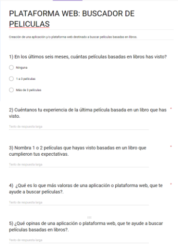
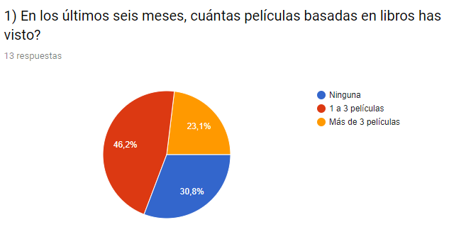

# Pelibooks

- Es una plataforma web responsive que ayuda a los fanáticos de la lectura y del cine a encontrar películas (información detallada) basadas en novelas.

## ¿Para qué sirve?

- Sirve para brindar una experiencia personalizada de búsqueda de información sobre películas basadas en una novela.

## ¿Cómo decidieron por ese producto / cómo validaron la idea?

- A través de encuestas (13 personas), entrevistas y feedback grupal continuo, encontramos que tenemos a un grupo del mercado no cubierto dentro del ámbito del entretenimiento y lectura; personas amantes de la lectura (público objetivo) y cinéfilos (público potencial).

***

## PARTICIPANTES:

* Vanessa Colqui.

* Yosseline Apcho.

* Betsy Vidal.

* Anny Gutierrez.

***

## PROCESO:

# Planificación:

* Usamos la herramienta 'Trello':

link : https://trello.com/b/jqDvmEmO/pelibooks-encuentra-tu-libro-favorito-hecho-pel%C3%ADcula

***

## Desarrollo de la idea

**MARTES: 16/01/2017**

**Planificación, Organización y Ejecución**

1. Descubrimiento e investigación.

   + Búsqueda de información en la web.
   Herramientas utilizadas: Google chrome.
   Tiempo utilizado: 2 hrs.

2. Sintesis y definición (elección del tema).

   + Desarrollo y envío online de la encuesta: "Plataforma Web, buscador de películas".
   Herramientas utilizadas: Lluvia de ideas, entrevista presencial.
   Tiempo utilizado: 1 hr.

3. Ideación.

   + Sketch, prototipado inicial.
   + Análisis de la encuesta.
   + Repartición de las actividades a realizar.
   "Del total de encuestados, el 100% indicó que la idea de un buscador de peliculas basadas en libros, sería buena y/o genial."
   Herramientas utilizadas: Material de laboratoria (UX), pizarra acrílica, google chrome.
   Tiempo utilizado: 1 1/2 hr.

**MIÉRCOLES: 17/01/2017**

**Planificación, Organización y Ejecución**

1. Feedback de los pendientes del día anterior.

   + Github, repositorio.
   + Readme, recolección de todas las evidencias.
   + Verificación del maquetado según tipo de vista.
   + Verificación de la funcionalidad según tipo de vista.
   Herramientas utilizadas: Trello.
   Tiempo utilizado: 1 hr.

2. **Prototipado con correcciones**

   + Maquetado y funcionalidad de las diferentes vistas.
   Tiempo utilizado: 4 hrs.

**JUEVES: 18/01/2017**

**Planificación, Organización y Ejecución**

1. Feedback de los pendientes del día anterior.

   + Verificación del maquetado según tipo de vista.
   + Verificación de la funcionalidad según tipo de vista.
   Herramientas utilizadas: Trello.
   Tiempo utilizado: 1/2 hr.

2. **Prototipado con correcciones**

   + Maquetado y funcionalidad de las diferentes vistas.
   Tiempo utilizado: 4 hrs.

**VIERNES: 19/01/2017**

**Planificación, Organización y Ejecución**

1. Feedback de los pendientes del día anterior.

   + Verificación del maquetado según tipo de vista.
   + Verificación de la funcionalidad según tipo de vista.
   Herramientas utilizadas: Trello.
   Tiempo utilizado: 1/2 hr.

2. **Prototipado con correcciones**

   + Maquetado y funcionalidad de las diferentes vistas.
   Tiempo utilizado: 4 hrs.

***

## Herramientas Utilizadas

- Html, para la estructura del contenido.
- Css, para darle estilo al contenido.
- Bootstrap, para estilo del contenido.
- The Open Movie Database (OMDb API).

## Integrantes

- Betsy Vidal
- Anny Gutierrez
- Yosseline Apcho
- Vanessa Colqui

***

## Fuente consultada

[Laboratoria LMS](https://laboratoria1.gitbooks.io/hackathon/content/)

[Bootstrap](https://getbootstrap.com/docs/3.3/css/#forms)

[W3School](https://www.w3schools.com/bootstrap/bootstrap_forms.asp)

**[OMDb API](http://www.omdbapi.com/)**
